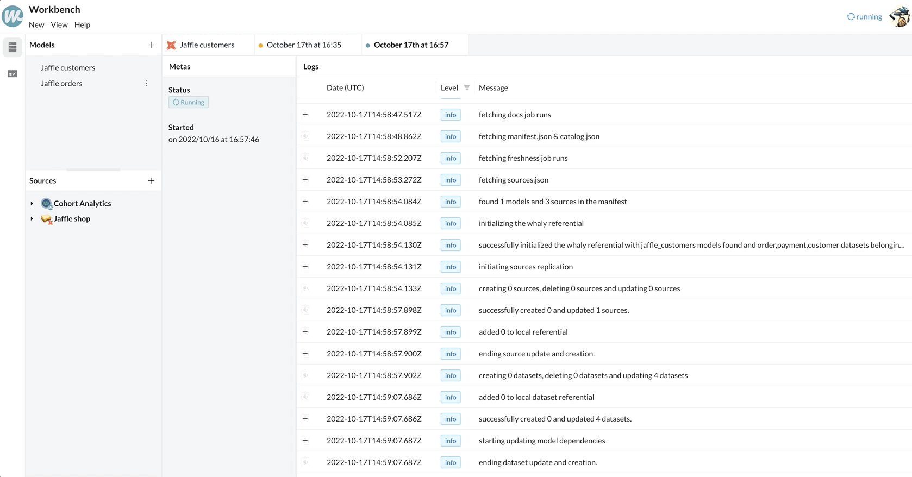

# Configuration

## Prerequisites

In order to use this integration you need:

* An account on dbt cloud
* An api access on dbt cloud (please note that only paid plan have an API access)
* A service token on the said account
* A job that outputs a manifest.json
* Optionnaly, a job that outputs run-results.json and sources.json

### Configure your service token on dbt

Go to your Account Settings > Service Token and create a new service token. Give this Service Token access to your desired project as well as the following roles:

<figure><figcaption></figcaption></figure>

* Metadata Only
* Job Admin

Once your service token is created, copy the key because you will not be able to access it again and save it for later.

### Configure your project to output the proper artifacts

In order to get access to your `manifest.json` your `source.json` and `run_results.json` please add the following steps in your job definition:

* `dbt run` - this will allow us to retrieve your tests results as well as the catalog definition
* `dbt source freshness` this will allow us to retrieve the freshness of your sources.

Please reference the job outputing those artifacts at your project level

<figure><figcaption></figcaption></figure>

### Find your account id and project id&#x20;

Open the job that you have configured at the previous step and extract the account id and project id from your URL.

The url should look like:

```
https://cloud.getdbt.com/next/deploy/<Account Id>/projects/<Project Id>/jobs
```

## Configure Whaly

Open Whaly and go to the workbench. On the workbench please click on view > settings. You should see a page like this:

<figure><figcaption></figcaption></figure>

next click on `use dbt for modeling.` You will then be prompted to enter your Service Token key, your account id as well as your project id.

Once this is done, open the execution panel and click on the plus sign at the top of the page to trigger a sync between Whaly and dbt cloud. Once the sync is done you will be able to view your models in the workbench.

<figure><figcaption></figcaption></figure>

Note that your models will be fetched  periodically and you can configure when they are fetch using the slider shown above.
