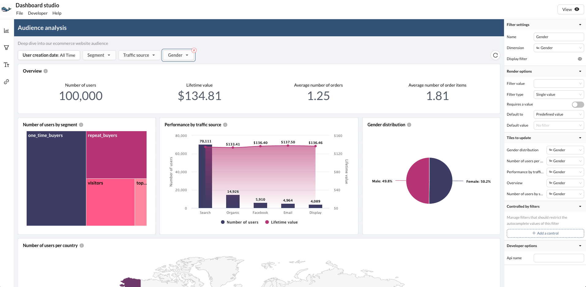

# 🎨 Theming

Themes are made to make it easy to reuse the same styling and colors across charts, questions and dashboards. Those are useful to keep your visualisation theming consistent across your organisation.

A good way to start is to create a Theme that is using your company brand identity so that Data consumers feel at home when accessing the charts.

## Palette

Palette are a set of colours that should used to color a given chart. Different kind of Palette exists:

* **Categorical**: Those are used when looking at discrete data, like Names, etc. They will contains a set of colours that will be used to represent the different values displayed in the chart. The colours used in this palette **should all be easily distinguished from one another** so that people don't confuse them.

<figure><figcaption>
To configure a <strong>categorical</strong> palette, you are being asked to enter each color one by one.
</figcaption></figure>

* **Sequential**: Those are used when looking at data that progress from low to high, like CSAT or customer score. They will store a gradient of continuous colours that will be used to represent a spectrum.
* **Diverging**: This is a special case of "**Sequential**". Diverging palettes are most effective when the class break in the middle of the sequence, or the lightest middle colour, is meaningfully related to the mapped data. They will store a gradient of continous colours that will be used to represent a spectrum.

<figure><figcaption>
<strong>Sequential and Diverging palettes are configured the same way, a spectrum of colors have to be configured</strong>
</figcaption></figure>

## Palette collections

Each palette is placed into a **Palette collection**. Those are used to keep together palettes that should be used together to keep a brand identity and a consistent experience.

An organisation can have any number of custom palette collection and each chart will be pointing to a Palette collection to know which colour to use.


Palette collections can be managed by any Admin of the organisation in the Settings.


When creating a palette collection, a palette of each kind should be provided. It is possible to add more than 1 palette per type if needed.

<figure><figcaption>
The form to create a new palette collection is asking for 1 palette of each kind
</figcaption></figure>

The choice of the palette to use in the collection is done at the chart level.

<figure><figcaption>
Setting a palette is done at the chart level
</figcaption></figure>


When updating the colours contains in the Palette collection, it will affect all charts using this collection in all dashboards.

If a chart colours needs to be specific and not managed through a Palette collection, chart builders can select "Custom" to set custom colors for the charts, unlinking it from any palettes.


## Default palette collection

In order to ease the use of an organisation custom palette, charts are assigned to the "**Default collection**" by default.

<figure><figcaption>
A chart linked to the Default collection
</figcaption></figure>

Inside the Palette collection management screen, it is possible to set any Palette collection as being the "Default" one.

<figure><figcaption>
Each palette collection can become the default one for the organisation
</figcaption></figure>
