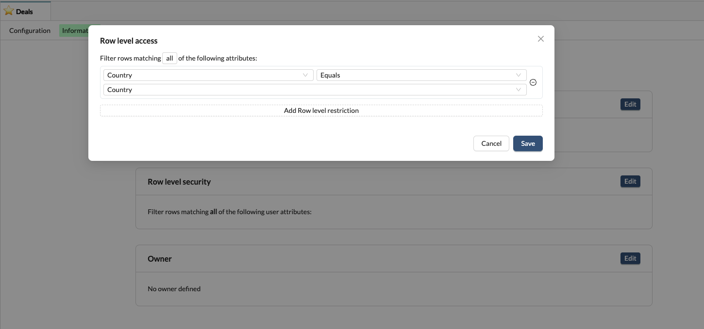

# 🎨 Theming

Themes are made to make it easy to reuse the same styling and colors across charts, questions and dashboards. Those are useful to keep your visualisation theming consistent across your organisation.

A good way to start is to create a Theme that is using your company brand identity so that Data consumers feel at home when accessing the charts.

## Palette

Palette are a set of colors that should used to color a given chart. Different kind of Palette exists:

* **Categorical**: Those are used when looking at discrete data, like Product Names, People Names, etc. They will store different colors that will be used to represent the different values found in the chart. The colors used in this palette should all be easily distinguished from one another so that people don't confuse them.

<figure><figcaption>
To configure a <strong>categorical</strong> palette, you are being asked to enter each color one by one.
</figcaption></figure>

* **Sequencial**: Those are used when looking at data that progress from low to high, like CSAT or customer score. They will store a gradient of continuous colors that will be used to represent a spectrum.
* **Diverging**: Those are used when looking at continuous data, like CSAT or customer scoring. Diverging palettes are most effective when the class break in the middle of the sequence, or the lightest middle color, is meaningfully related to the mapped data. They will store a gradient of continous colors that will be used to represent a spectrum.

<figure><figcaption>
<strong>Sequencial and Diverging palettes are configured the same way, a range of color have to be configured</strong>
</figcaption></figure>
