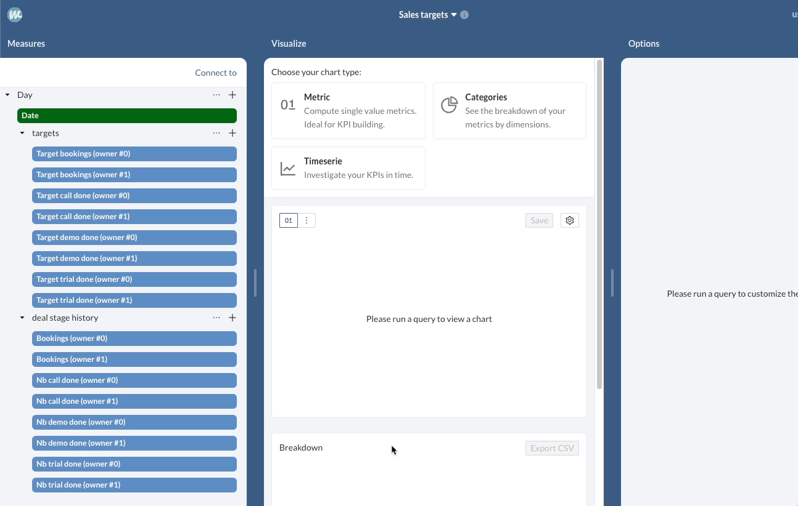

# 🎯 Build a target oriented sales dashboard

**Objectives**:&#x20;

As a sales manager, having a target oriented reporting strategy for your team is a driver of success.&#x20;

Objective tracking is a must-have tool that will animate your team and enable your teammate to deliver. It's a good start for starting sales gamification!

On a higher level, it will give you a good tool to drive your 1-to-1 meetings with your Sales rep and give you an easy way to identify which teammate requires coaching and on which topic.

If you follow this article, you will be able to build the following dashboard:

.png>)

## High level plan

* 🚛  Importing data into Whaly
  * Importing CRM data
  * Importing target data
* 🔗  Creating the relationships between the datasets
* 📆 Creating the exploration from Days
* 📈 Creating the charts
* ✨ Creating the dashboard

### 🚛  Importing data into Whaly


On this article we'll use data from Airtable but the same pattern can be applied to any CRM such as [Hubspot](https://docs.whaly.io/sources/source-catalog/sales/hubspot), [Salesforce](https://docs.whaly.io/sources/source-catalog/sales/salesforce) and [Pipedrive](https://docs.whaly.io/sources/source-catalog/sales/pipedrive) 🤗


#### Importing CRM data

To get started, the first thing we are going to do is import our CRM data into Whaly. Our CRM data is composed of two tables.

One "deal" table containing information about our deals:&#x20;

.png>)

One "deal stage history" table containing information about our deals movements throughout our sales pipelines:&#x20;

.png>)

#### Importing target data

The second type of data we are going to import is the targets. We will create monthly targets for our salespersons and structure our data with the following columns:

* **owner\_id**: the owner to whom the target applies
* **type**: the current objective (revenue, number of call done, ...)&#x20;
* **date**: the current objective date&#x20;
* **target**: the current target amount


Targets should be written in a system on which you can easily input new data. We recommend to use either [Google Sheets](https://docs.whaly.io/sources/source-catalog/no-code/google-sheets) or [Airtable](https://docs.whaly.io/sources/source-catalog/no-code/airtable) for this task.


Let's take have a look at our example target database:&#x20;

.png>)

### 🔗 Creating the relationships between the datasets

Before creating our relationships, we need to ensure that our data will match. In our days table, the date is a timestamp at the beginning of the day (ex: `June 27 2022, 00:00:00`). In our deal stage history table, our timestamps have hours, minutes and seconds (ex: `February 17 2020, 17:39:02`). We will need to round our dates in our deal stage history table in order to have matching data for the relationship. Let's do it:

1. Open the workbench, go the your deal stage history view
2. Click on add a column, select formula, and use the cohort formula `day` as the type in order to round the date to the current day:

.png>)

As our targets and deals are going to be linked using our Days table, we will need to create relationships between:&#x20;

1. Days _has many_ Targets&#x20;
2. Days _has many_ Deal Stage History
3. Deal _has many_ Deal Stage History

Let's get into the workbench, on the day table and create the following relationships:

.png>)

We will also need to create the relationship between our deals and deals stage history (this is optional is you are using Whaly native CRM connectors that auto create such relationships):&#x20;

.png>)

### :telescope: Retrieve the missing columns in the deal stage history table

It's possible that your deal stage history table, that we will use our exploration, is missing some columns, such as our deal amount and our owner id. Fortunately we have this information in our deal table, so it's easy to bring them in the deal stage history table.&#x20;

Let's do it :&#x20;

1. Open the workbench, go the your deal stage history view
2. Click on add a column, select lookup, and fill the information as required:

.png>)

Now let's do the same thing for our amount column:

.png>)

Now that we have all our data, we can start building our exploration.

### 📆  Creating the exploration from Days

Let's get to our workspace and create a new exploration, starting from our Days table. We do this in order to be able to add our "Deal Stage history" and "Targets" tables as related data.&#x20;

Let's do it:

1. Create a new exploration from `Days`
2. On the Days table:
   1. add `Date` as a dimension
   2. add `Deal stage history` as a related data
   3. add `Targets` as a related data
3. Remove all the metrics created automatically&#x20;

You should now have an exploration that looks like the following:

.png>)

Now we will create our metrics for targets and current progress.

Let's get started with the bookings target:&#x20;

1. Click on `Add a metric` under the `targets` table:&#x20;
2. Create a sum of the column `target`
3. Filter on all rows matching your desired `owner_id` and target type `revenue`
4. Give your custom metric a name, for example: `Target bookings (owner #0)`
5. Add a currency suffix to ensure our charts will look good
6. Create the metric

.png>)

Now let's do the same for the current bookings of our `Owner #0`:

* Click on `Add a metric` under the `deal stage history` table:&#x20;
* Create a sum of the column `amount`
* Filter on all rows matching your desired `owner_id` and deal stage `closedwon`
* Give your custom metric a name, for example: `Bookings (owner #0)`
* Add a currency suffix to ensure our charts will look good
* Create the metric


If the columns amount and owner\_id are missing from the deal stage history table you can easily add them using a lookup column in the workbench. See our guide here: [https://docs.whaly.io/data-management/workbench#2.-lookup](https://docs.whaly.io/data-management/workbench#2.-lookup)


.png>)

We just have to repeat these steps for each of our owners and metrics that we want to follow. For example, with 2 owners and with revenue, Nb call done, Nb demo done, Nb trials done, we should build the following exploration:&#x20;

.png>)

### 📆  Creating the charts

In order to create the charts, we will:

1. select the `Metric` chart type
2. add both our current KPI and target to our query builder, for example Bookings `(owner #0)` and `Target bookings (owner #0)`
3. add our `Date` dimension as the time field,
4. select a relevant time range
5. set `Gauge` as metric type
6. run the query

### ✨ Creating the dashboard

We can repeat the previous step as many times as necessary in order to build our dashboard. For our example, with 4 KPIs and two different salespersons we can build the following report:&#x20;

.png>)

And voilà, that's it :tada:
