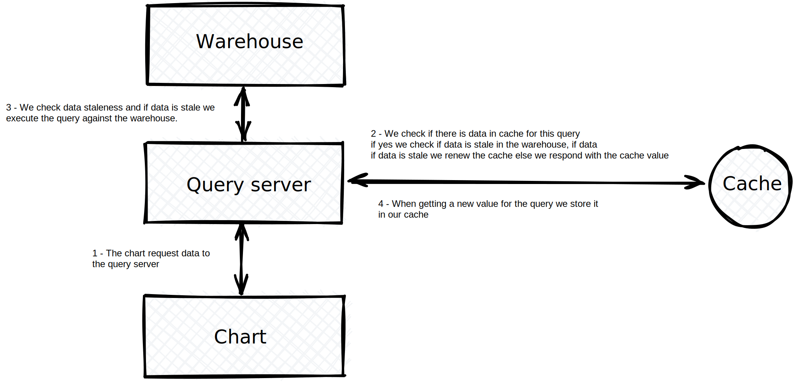

# 💫 Caching

In order to keep Dashboards and Questions running fast, Whaly is leveraging query result caching in a low latency database for subsequent loads.

This is particularly useful :

* Getting quick access to your charts and figures without waiting for your warehouse response
* Reducing your Data Warehouse bill as this reduce your querying cost.

### Cache implementation

However, in order to get access of the latest version of the data, Whaly is continuously scanning your raw tables to identify any change on the data.

This is done by querying the `_whaly_synced` column of any table used in an Exploration. Every **10 minutes**, Whaly query the `MAX(_whaly_synced)` on each table and if there is a change in the value, it invalidate all the cached results to trigger new queries when loading Reports.

Hence, please add a `_whaly_synced` column in your models to get the best data freshness possible.

All the tables loaded by Whaly connectors are including this column by default so when using directly the output of a Whaly connector, everything is already setup!

### Manually refreshing the cache

By clicking on the refresh 🔁 icon of the dashboard and question, the cache is invalidated instantly, queries are being run on your data warehouse and your results are up to date!

So if you have a doubt on the freshness of a chart, don't hesitate to refresh it!
