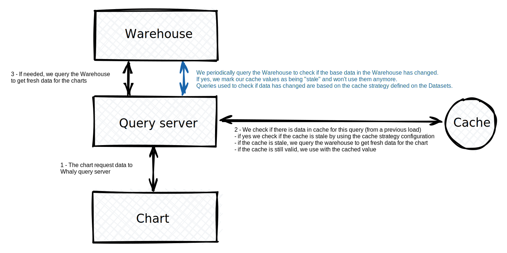

# 💫 Caching

In order to keep Dashboards and Questions running fast, Whaly is leveraging a query results caching strategy for subsequent loads.&#x20;

Our cache server is built around a low latency database that is both faster and cheaper than querying your Warehouse.

This is particularly useful to:

* Getting quick access to your charts and metrics
* Reducing your Data Warehouse costs as we limit the number of queries made on it

The cache strategy to be used to check whether if data has changed in your Warehouse is configurable and can be fined tuned depending on your needs.

### Periodic freshness check

Every **2 minutes,** Whaly will perform a freshness check on your Warehouse tables to check if there was any change done to it.

Whaly supports 4 different freshness strategies:

1. Freshness of tables coming from Whaly connectors
2. Based on a column value
3. Based on time
4. Based on a defined SQL query for complex use cases

### 1. Freshness of tables coming from Whaly connectors

**No configuration required**

This cache strategy is automatically configured for all tables produced by Whaly connectors. Whenever the connector have completed the load of data in your Warehouse, we'll mark all cached values for those tables as being stale.

This is automatic and can't be updated.

### 2. Based on a column value

**Configuration required**: a column name (ex. `synced_at`)

This is done by querying the maximum value of a configured column of any table used. The column to be used has to be present in the table on which the cache strategy is being used.&#x20;

Whaly will generate a `SELECT MAX(<columnName>) FROM table` query and invalidate all the cached values if this query returns a new value.

It is good practise to use a column that is filled with the timestamp of the update time of rows. Ex. `synced_at` / `updated_at`

### 3. Based on time

**Configuration required**: a time interval (ex. `2 Minutes`).

This is done by generating a query whose result will change every N minutes, periodically invalidating the cached value.

This is a powerful strategy as it can applied on all tables in all cases, but it's the more efficient way of detecting changes quickly or effectively as it'll trigger cache invalidation either too soon or too late in many circumstance.

So use it when other strategies are not available.

### 4. Based on a defined SQL query for complex use cases

**Configuration required**: a valid SQL query.

This is done by query the Warehouse with the given SQL query. Whenever the result of the query will change, we'll mark all cached values as being stale.

This can be used to query metadata of your Warehouse when it's available in SQL or to query multiple tables to decide if the table has been updated.

This is the most versatile cache strategy that is offered by Whaly.

## Manually refreshing the cache

By clicking on the refresh 🔁 icon of the dashboards and questions, the cache is invalidated instantly, queries are being run on your data warehouse and your results are up to date!

So if you have a doubt on the freshness of a chart, don't hesitate to refresh it!

This manual refresh button is offered for all end users by default.
