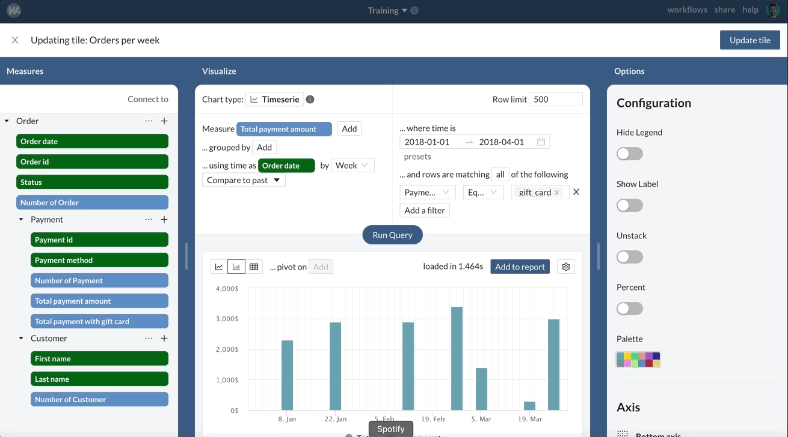

# 2⃣ Creating metrics and formatting charts

**Objectives:** in this exercise we will learn how to filter a query, create a metric, create a calculated metric and use the chart formatting options. In this article we will learn about:&#x20;

### Filtering a query

In this exercice we want to :&#x20;

> Add the amount of payment paid with Gift cards per month

Start by duplicating the initial tile from the training dashboard, then:&#x20;

1. Replace the measure "**Number of orders**" with "**Total payment amount**"
2. Add a filter on the query editor: Payment method equals gift card

Great, now we can see the amount paid each week by gift card. However, having a filter at the chart level is not optimal as it does not allow other users to easily re-use this metric.&#x20;

### Creating a filtered metric

We will create a new metric corresponding to the payments with gift card:&#x20;

1. Next to Payments in the left panel, click on the + sign and on add a metric
2. Set the metric to the sum of amount
3. In the advanced settings :&#x20;
   1. Filter on payment method **gift\_card**
   2. Give your metric a name: **Total payment with gift card**
   3. Set the metric type as number, and add $ as a suffix

.png>)

Now we can add our new metric to our chart and run the query. We can see that the two measures are displayed, but are equals.&#x20;

This is because we still have the filter at the chart level. Let's remove it and run the query again: now we can see both the total payment amount and the total payment amount by gift card side by side.

### Creating a calculated metric

Now imagine we want to add the percentage of payment made by gift card on our chart. To do so, click on the + sign next to Payment in the left side panel, and click on Add a calculated metric. In the formula editor, type :&#x20;

> Total payment with gift card / Total payment amount

Give your metric a name, for example : %age of payment amount with gift card, and set the type as percentage in the advanced settings. Save your metric. Now add this metric to the chart and click on run query.&#x20;

The metric is added to our chart, but is too small to be visible. In order to fix, we will need to edit our chart options.

### Formatting our chart

In the right panel:&#x20;

1. Toggle "**labels**" to display labels
2. Enable the right axis
3. Assign the **% of gift card payment** to this right axis, and change it's type to **Area**

