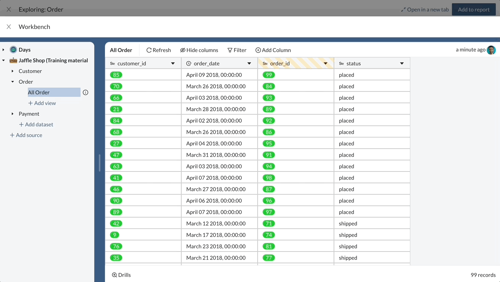

# 3⃣ Customizing the drill view and using lookup columns

**Objectives:** in this exercise we will learn what is the drill view, how to change the columns displayed in the drill view, and how to use lookup formulas

### Opening the drill view

On each chart of a report, you are able to drill down in the data. This allows you to see the underlying data used to build a chart. For example, if we click on a bar in our order per week chart, we will be able to see the underlying data composing this bar :&#x20;

.png>)

### Going into the workbench

Interesting ! But seing order ids may not give viewers the information they need, it may be interesting to add some columns to this view in order to make this drill view more useful, for example the order date, the order status and the customer name.&#x20;

Let's get to work :&#x20;

1. Open the exploration of your tile
2. Click on the more button next to the Order table and click on open in workbench

We are now in the workbench screen of Whaly.&#x20;

### Customising the drill view

In order to add columns to your drill view

* Click on the drills button at the bottom of the data table
* Select the columns you need, and hit Submit

### Using lookup columns

Our drill is more interesting, but let's say we also want to have the customer name. In order to do this, we need to add the customer name in column of our order table :&#x20;

1. Click on add column
2. Click on lookup&#x20;
3. Select the customer first name column from the customer table
4. Give a name to your column, for example `customer_fist_name`
5. Save :floppy\_disk:

Now our customer name is available in our order table, we can add it to our drill view and it will be visible in our reports :&#x20;

.png>)
